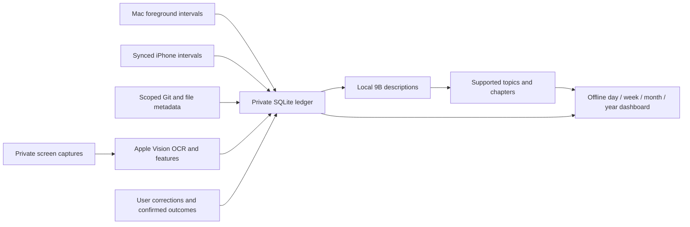

# Architecture

Your Time records digital activity and presents a private chronicle. The unit
of evidence is an observed interval or captured frame, not an inferred success.

## Module boundaries

| Area | Entry points | Responsibility |
| --- | --- | --- |
| Capture | `mac_activity.py`, `secure_capture.py`, `phone_import.py`, `native/` | Observe foreground state and bounded local source data |
| Enrichment | `project_activity.py`, `project_file_watch.py`, `index_screenshots.py`, `index_features.py` | Scoped metadata, OCR and visual fingerprints |
| Storage | `secure_store.py`, `private_io.py` | Transactions, private atomic files and safe file descriptors |
| Inference | `model_execution.py`, `vision_fallback.py`, `local_synthesis.py`, topic tagging modules | One local model at a time, bounded inputs, validated outputs |
| Measurements | `inference_telemetry.py`, `telemetry_summary.py`, `engine_identity.py` | Private attempt histories, content-free counters and explicit metric scope |
| Specialization | `specialization_dataset.py`, `specialization_training.py`, `specialization_worker.py`, `specialization_benchmark.py`, `specialization_study.py` | Frozen private inputs, bounded resident inference, resumable QLoRA and independent acceptance gates |
| Evidence continuity | `activity_context.py`, `activity_episode_store.py`, `chronicle_activity.py` | Evidence-linked hypotheses and exact observed support; model allocation remains gated |
| Scheduling | `overnight_schedule.py`, `overnight_text.py`, shell wrappers, `launchagents/` | Overnight stages and resource gates |
| Accounting | `daily_analysis.py`, `daily_focus.py`, `behavior_analysis.py`, `topic_allocation.py`, `data_quality.py` | Interval joins, attribution and explicit coverage |
| Presentation | `local_dashboard.py`, `dashboard_ui.py`, `dashboard_explore.py`, `dashboard_timeline.py`, `chronicle_rollup.py` | Private static HTML and historical rollups |
| Optional inputs | `browser_extension/`, `browser_bridge.py`, `calendar_import.py` | Explicitly enabled, bounded metadata sources |
| Verification | `tests/`, `tools/check.py`, `setup_check.py`, `chronicle_audit.py` | Synthetic regression tests, installed state and aggregate accounting checks |
| Publication | `publish_source.py` | Reviewed source snapshots with separate public ancestry |

Runtime entry points remain in the root because installed LaunchAgents and
signed readers refer to them. Tests and engineering guides have separate
directories. A package migration must include launcher and signing migration;
moving installed entry points casually would break collection or permissions.

## Data and trust

- The private state root is outside the repository, under
  `~/Library/Application Support/personal-activity-ledger`.
- `private_io` opens directory components without following symlinks. It
  creates private directories, rejects linked/foreign-owned file targets, and
  publishes complete files through a random exclusive temporary file and rename.
- SQLite uses transactions and a mode-0600 database. Its existing WAL, SHM and
  journal files are checked before a write connection. This preflight is not a
  defense against a hostile process that already controls the same user account.
- Captured text and model output remain untrusted data. Model workers have no
  action tools. A model label cannot become a confirmed outcome.
- Dashboard text is built with DOM text nodes; embedded JSON escapes HTML
  delimiters. Hash-based script/style policies block unapproved code and network
  requests. A local HTML file is still sensitive plaintext.
- A scheduled job, completed inference, supported attribution and confirmed
  accomplishment are distinct states. Missing data stays unknown; device times
  are never added together as if they were independent.

## Execution

Collection is lightweight and continuous. Heavy inference is restricted to
00:30–08:00 America/Chicago, with vision ending at 07:00. AC, storage, memory,
load and remaining-time gates are checked between bounded model calls. Shared
locks prevent overlapping model processes and survive a coordinator crash.
The native launcher installs an exec-surviving deadline so an abandoned child
cannot retain the model lock indefinitely.

Receipts contain aggregate counters and stop reasons. Latest receipts can be
replaced; completed overnight attempts also retain separate historical receipts.
The dashboard rebuilds atomically and historical cache entries retain support
hashes so changed evidence invalidates stale model conclusions.
